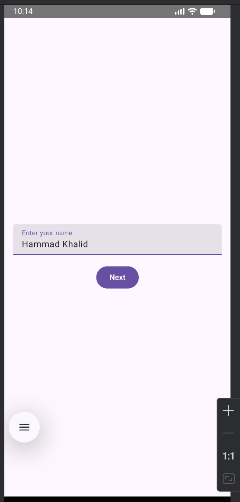
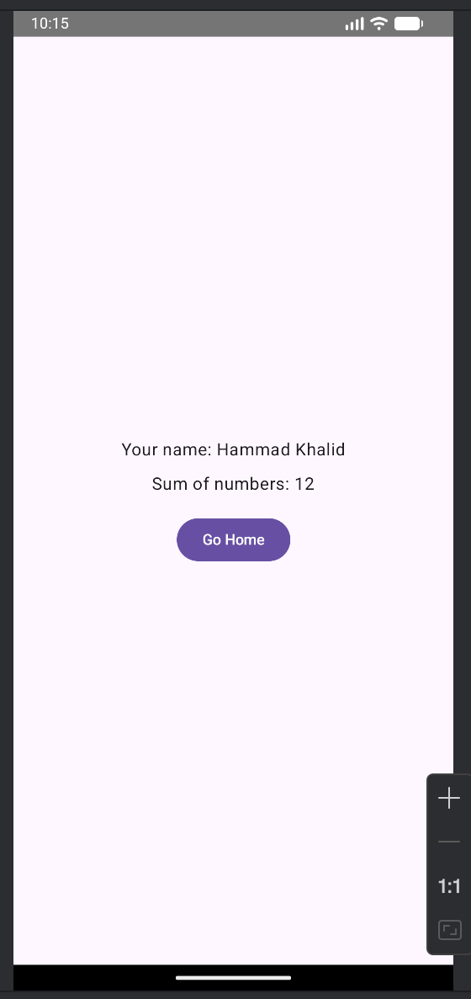

# SumGreeting – Android App with Jetpack Compose & Navigation

A clean, modern **3-screen Android application** built with **Kotlin**, **Jetpack Compose**, and **Navigation Compose**. Demonstrates state management, screen transitions, data passing, and smooth animations.

Perfect for learning **Jetpack Compose**, **Navigation**, and **Android best practices**.

---

## Features

- **Screen 1 (Home)**: Enter your name → Next button  
- **Screen 2 (Numbers)**: Enter two numbers → Back & Next buttons  
- **Screen 3 (Result)**: Shows **your name** and **sum of numbers** → Go Home button  
- Smooth **fade-in/fade-out animations** (700ms) using `tween`  
- Full **back navigation** support (system back + UI buttons)  
- **No XML** — 100% Jetpack Compose  
- Clean architecture with `ui` package separation  

---

## Tech Stack

| Technology | Version |
|----------|--------|
| **Kotlin** | 2.0.20 |
| **Jetpack Compose** | BOM 2024.10.01 |
| **Compose Compiler** | 1.5.14 |
| **Navigation Compose** | 2.8.3 |
| **Material 3** | Latest |
| **Android Gradle Plugin** | 8.5.2 |

---

## Screenshots

